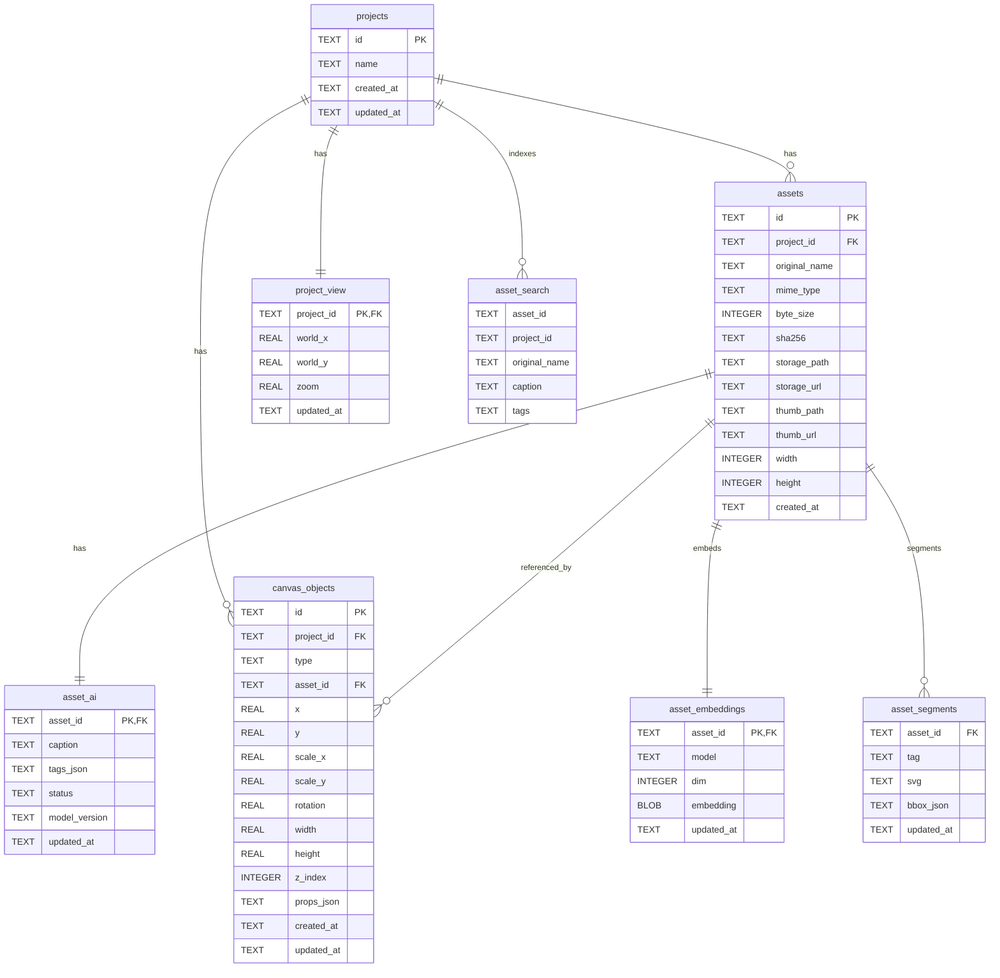
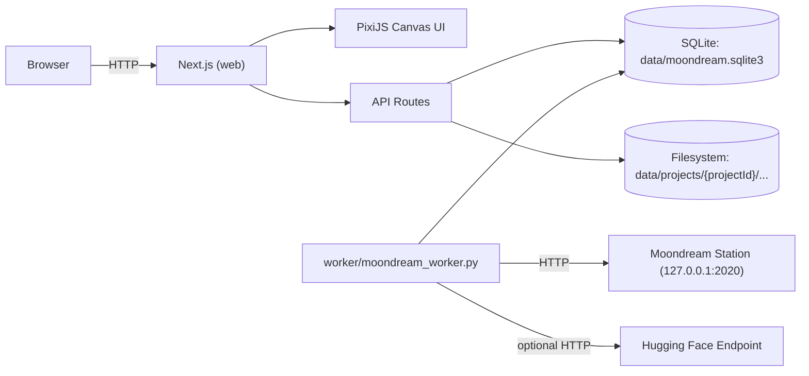

# Moondream Invite Canvas

High‑performance, Figma‑like canvas for building “invite” layouts by dropping images onto an infinite board, moving/resizing them, and saving everything locally.

- **Frontend**: Next.js + PixiJS (WebGL)
- **DB**: SQLite (with FTS5 search)
- **Storage**: local filesystem under `data/`
- **AI**: Moondream Station (local) or Hugging Face endpoint (optional worker)


## Introduction

This repo is an MVP for a fast, responsive design surface:

- Drop images onto the canvas (drag & drop)
- Pan/zoom with a minimap
- Select / multi‑select, move, resize, delete
- Persist canvas layout and viewport per project
- Store assets + thumbnails on disk
- Search assets (filename + AI caption/tags)
- Optional background worker to caption/tag images via Moondream

## Quickstart (run the app)

Requirements:

- Node.js 20+
- Python 3.10+ (only needed for Moondream / worker)

Install and run:

```bash
cd web
npm install
npm run dev
```

Then open `http://localhost:3000`.

> `npm run dev` starts both Next.js and `moondream-station` (if installed). You may need to type `start` inside the Moondream Station REPL to start the REST API.

## Install Moondream Station (local)

Install the `moondream-station` CLI so it’s available on your PATH.

Recommended (via pipx):

```bash
python3 -m pip install --user pipx
python3 -m pipx ensurepath
pipx install moondream-station
```

Or (via pip):

```bash
python3 -m pip install --user moondream-station
```

Run it:

```bash
moondream-station
```

Inside the REPL:

- `models list`
- `models switch <name>`
- `start` (defaults to `http://127.0.0.1:2020/v1`)

Sanity check:

```bash
curl -s http://127.0.0.1:2020/health
```

## Optional: run the Moondream worker (caption/tags + embeddings)

The worker polls the shared SQLite DB (`data/moondream.sqlite3`) for images with `asset_ai.status = 'pending'` and writes back:

- `asset_ai.caption`
- `asset_ai.tags_json` (best‑effort)
- optional: caption embeddings + segmentation rows (schema exists)

Setup:

```bash
cd worker
python3 -m venv .venv
source .venv/bin/activate
pip install -r requirements.txt
python moondream_worker.py
```

Environment variables (examples):

```bash
# Local Moondream Station
export MOONDREAM_PROVIDER=local_station
export MOONDREAM_ENDPOINT=http://127.0.0.1:2020

# Hugging Face endpoint (generic adapter)
# export MOONDREAM_PROVIDER=huggingface
# export HF_ENDPOINT_URL="https://your-hf-endpoint"
# export HF_TOKEN="..."
```

## Repository structure

- `web/`: Next.js app (canvas UI, API routes, DB access layer)
- `worker/`: Python worker for asynchronous Moondream processing
- `moondream_batch.py`: standalone batch helper to hit a running Moondream Station REST API
- `data/`: local dev data (SQLite DB + per-project assets/thumbs/previews)

## Mermaid: database schema (SQLite)



## Mermaid: app architecture


